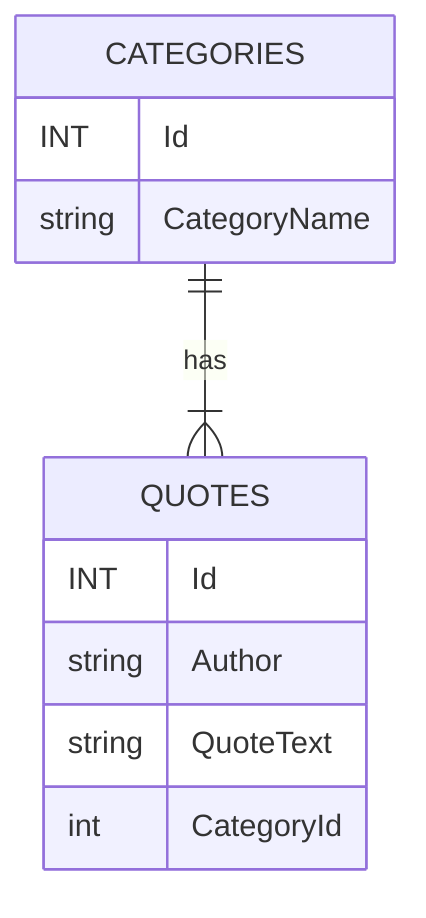
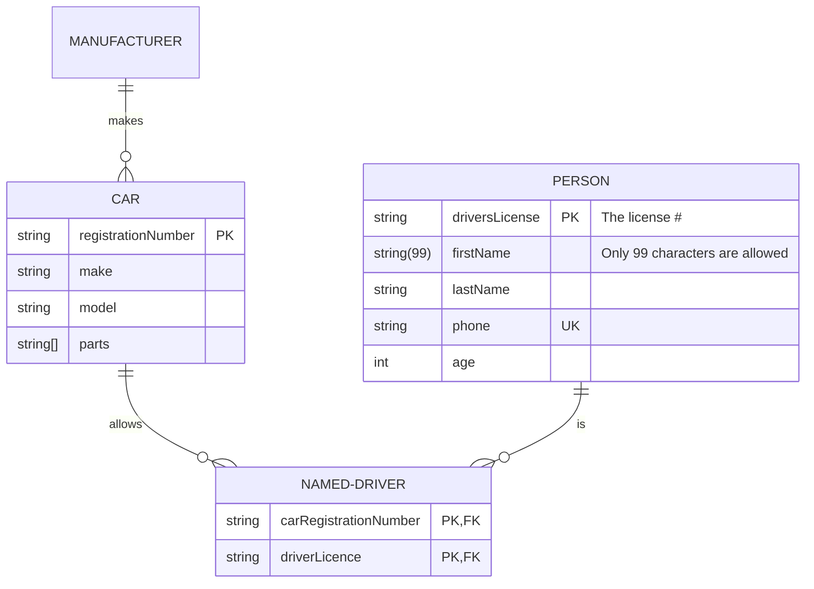

## Assignment

## Task 1:

Functions.

- Learn the project from <a href="https://github.com/NurulloSulaymonov/DapperCrud" target="_blank">Last Practice</a>
- Use Clean Arcitecture design (Domain,Infrastructure,Console).
- Methods to implement 
  - Add & edit Quote and Category
  - Get list of Qutoes including categoryName - Nigora
  - Get all quotes by category (send category id and get all quotes).   - Safiya
  - Get a random quote. - Nasim
  - Get all Categories with number of quotes - Komron
  - Get all Authors with number of quotes - Chori
  - Get number of Authors and number of Quotes  - Rasul
  - Get Quotes filtering with quote text.  - Bakhtovar
  - Get top 10 most popular authors. - Abdullo 
  - Get Categories including list of quotes in it. - Shahrom
         - 1, MOtivation
           - read book
           - work hard
           - eat less
         - 2, Sport
           - go to gym
           - run
   
- Learn the Dapper from <a href="https://www.learndapper.com/dapper-query" target="_blank">Dapper documentation</a>

Requirements:
- Create a new repository in your project. Name it with `homework_25.05.2023`
- Add gitignore into your project (`dotnet new gitignore`)

On average, this task can be completed in 2-3 hours, but you are welcome to spend more time on it to submit a better quality code.
  Make sure to send it until **25.05.2023T18:00**.
  Happy Coding 😊
